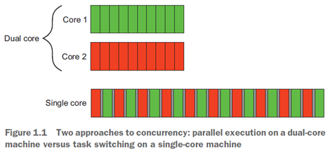
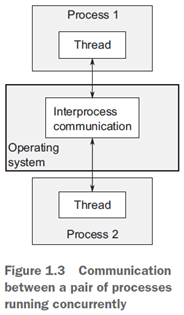
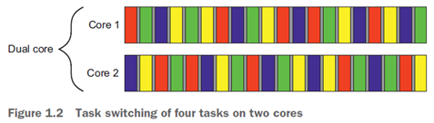
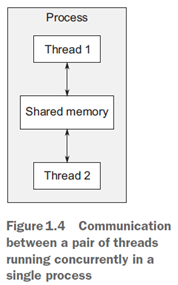

.. contents:: Table of Contents

Hello, world of concurrency in C++
====================================

1.1	What is concurrency?
------------------------

At the simplest and most basic level, concurrency is about two or more separate activities happening at the same time.

1.1.1	Concurrency in computer systems
^^^^^^^^^^^^^^^^^^^^^^^^^^^^^^^^^^^^^^^^

Concurrency in terms of computers, mean a single system performing multiple independent activities in parallel, rather than sequentially, or one after the other.

|

**Task switching**

By doing a bit of one task and then a bit of another and so on, it appears that the tasks are happening concurrently. This is called task switching.

|

**Hardware concurrency**

Computers containing multiple processors or multiple cores within a processor (or both), these computers are capable of genuinely running more than one task in parallel. We call this hardware concurrency.

|

**Context switch**

On a single-core machine doing task switching, the chunks from each task are interleaved. But they are also spaced out a bit (in figure 1.1, this is shown by the gray bars separating the chunks being thicker than the separator bars shown for the dual-core machine); in order to do the interleaving, the system has to perform a context switch every time it changes from one task to another, and this takes time.

In order to perform a context switch, the OS has to save the CPU state and instruction pointer for the currently running task, work out which task to switch to, and reload the CPU state for the task being switched to. The CPU will then potentially have to load the memory for the instructions and data for the new task into the cache, which can prevent the CPU from executing any instructions, causing further delay.

**Hardware threads**

The number of hardware threads, which is the measure of how many independent tasks the hardware can genuinely run concurrently.

Even with a system that has genuine hardware concurrency, it’s easy to have more tasks than the hardware can run in parallel, so task switching is still used in these cases.
 
How you make use of concurrency in your application may well depend on the amount of hardware concurrency available.

1.1.2	Approaches to concurrency
^^^^^^^^^^^^^^^^^^^^^^^^^^^^^^^^^

Two approaches to concurrency

#. Concurrency With Multiple Processes
#. Concurrency With Multiple Threads

Concurrency With Multiple Processes
~~~~~~~~~~~~~~~~~~~~~~~~~~~~~~~~~~~~

Divide the application into multiple, separate, single-threaded processes that are run at the same time.

These separate processes can then pass messages to each other through all the normal inter process communication channels (signals, sockets, files, pipes, and so on).

These separate processes can then pass messages to each other through all the normal inter process communication (IPC) channels (signals, sockets, files, pipes, and so on).

**Advantage**

It can be easier to write safe concurrent code with processes rather than threads.

You can run the separate processes on distinct machines connected over a network.

 
Concurrency With Multiple Threads
~~~~~~~~~~~~~~~~~~~~~~~~~~~~~~~~~
The alternative approach to concurrency is to run multiple threads in a single process. Threads are much like light weight processes: each thread runs independently of the others, and each may run a different sequence of instructions.

But all threads in a process share the same address space, and most of the data can be accessed directly from all threads—global variables remain global, and pointers or references to objects or data can be passed around among threads.

This is the favored approach to concurrency in mainstream languages, including C++.

The flexibility of shared memory also comes with a price: if data is accessed by multiple threads, the application programmer must ensure that the view of data seen by each thread is consistent whenever it’s accessed.

 

1.1.3	Concurrency vs. parallelism
^^^^^^^^^^^^^^^^^^^^^^^^^^^^^^^^^^^^^

**Parallelism** is much more performance-oriented. Parallelism when concern is taking advantage of the available **hardware** to increase the performance of bulk data processing.

**Concurrency** when their primary concern is separation of concerns, or responsiveness. Concurrency is related to **programming**.

References
-----------

Book | Anthony Williams - C++ Concurrency in Action

