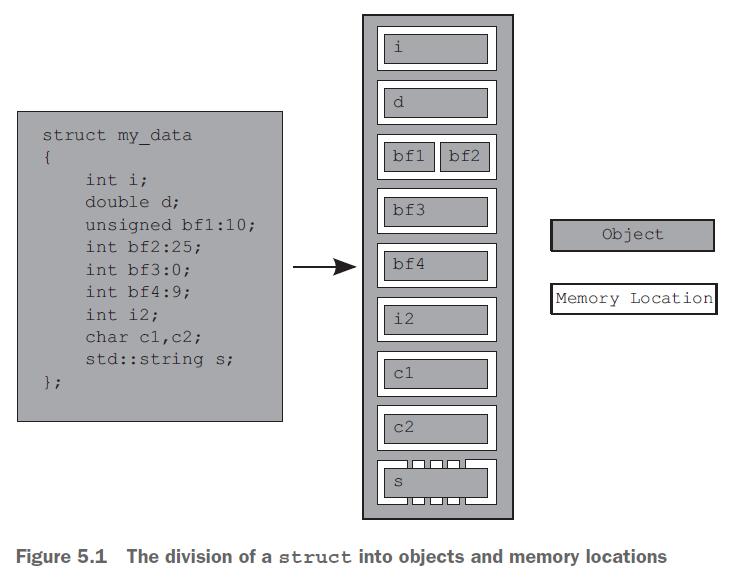

.. contents:: Table of Contents

05 The C++ memory model and operations on atomic types
========================================================

The atomic types and operations provide facilities for low-level synchronization operations that will commonly reduce to one or two CPU instructions.

5.1 Memory model basics
------------------------

Two aspects to the memory model:

#. The basic structural aspects
#. The concurrency aspects

5.1.1 Objects and memory locations
^^^^^^^^^^^^^^^^^^^^^^^^^^^^^^^^^^^^

All data in a C++ program is made up of objects.

The C++ Standard defines an object as “a region of storage,” although it goes on to assign properties to these objects, such as their type and lifetime.

	
An object is stored in one or more memory locations

Each memory location is either an object (or sub-object) of a scalar type or a sequence of adjacent bit fields

Though adjacent bit fields are distinct objects, they’re still counted as the same memory location

	
	
**Example**

 
The entire struct is one object that consists of several sub-objects, one for each data member.

The bf1 and bf2 bit fields share a memory location, and the std::string object, s, consists of several memory locations internally, but otherwise each member has its own memory location.

The zero-length bit field bf3 separates bf4 into its own memory location, but doesn't have a memory location itself.

5.1.2 Objects, memory locations, and concurrency
^^^^^^^^^^^^^^^^^^^^^^^^^^^^^^^^^^^^^^^^^^^^^^^^^^
	
If two threads access the same memory location,

- If neither thread is updating the memory location, it's fine; read-only data doesn’t need protection or synchronization
- If either thread is modifying the data, there’s a potential for a race condition
		
To avoid the race condition, there has to be an enforced ordering between the accesses in the two threads.

#. fixed ordering such that one access is always before the other
#. ordering that varies between runs of the application, but guarantees that there is some defined ordering

To ensure there’s a defined ordering

#. use mutexes
#. use the synchronization properties of atomic operations either on the same or other memory locations to enforce an ordering between the accesses in the two threads

If there’s no enforced ordering between two accesses to a single memory location from separate threads, one or both of those accesses is not atomic, and if one or both is a write, then this is a data race and causes undefined behavior.

	
To avoid the undefined behavior

- can also use atomic operations to access the memory location involved in the race
- This doesn’t prevent the race itself—which of the atomic operations touches the memory location first is still not specified—but it does bring the program back into the realm of defined behavior.

5.1.3 Modification orders
^^^^^^^^^^^^^^^^^^^^^^^^^^

Every object in a C++ program has a modification order composed of all the writes to that object from all threads in the program, starting with the object’s initialization.

If the object in question isn’t one of the atomic types, you’re responsible for making certain that there’s sufficient synchronization to ensure that threads agree on the modification order of each variable.	

If you do use atomic operations, the compiler is responsible for ensuring that the necessary synchronization is in place.

References
----------

Anthony Williams - C++ Concurrency in Action

