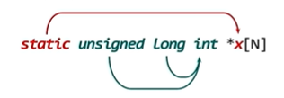

.. contents:: Table of Contents

Back to Basics: Declarations in C++
===================================

Entities and Properties
-----------------------

A computer program is esentially 

- entities
- action involving those entities

In C++, an entity can be

- function
- namespace
- object 
- template
- type 
- value

Programs can declare names to designate entities
Declared name can have associated properties such as 
- type
- scope
- storage duration
- linkage

Declarations and Definitions
----------------------------

Declaration in program is used to

- provide some name and properties for entity
- it might be here or somewhere else
	
Definition is declaration that says

- name and complete set of properties for an entity is right here
	
All definitions are declarations, but not all declarations are definitions.

A **function declaration** (no function body)

.. code:: cpp

	int fun(int);

tells compiler how to generate code that calls this function

it does not tell the compiler how to generate the code for the function itself

A **function definition** is also a declaration

.. code:: cpp

	int fun(int val) {
		return val * 2;
	}

It tells compiler everything it needs to know to actually create the function

|
|

In C++, an object declaration (outside a class) is also a definition unless it contains an extern specifier and no initializer

.. code:: cpp

	int         val;		// definition
	extern int	val = 5;	// definition
	extern int	val;		// non-defining declaration

An object declaration does not allocate any storage for the object while a definition does

There is similar distinction for classes and templates

|
|

The Structure of Declarations
-----------------------------

Every object and function declaration has two main parts
	
- a sequence of one or more declaration specifiers
- a declarator (or a sequence thereof, separated by commas)
	
.. code:: cpp

	static unsigned long int	\*x[N];
	------------------------	----------
	declaration specifier		declarator

Declaration Specifiers and Declarators
^^^^^^^^^^^^^^^^^^^^^^^^^^^^^^^^^^^^^^^

Each declarator specifier is either

- a type specifier
- a non-type specifier
	
**A type specifier**

- sequence of one or more keywords such as int, long, unsigned
- an identifier or qualified name that names a type such as std::string 
- a template specialization such as vector<int>

**A non-type specifier**

- a storage class specifier such as extern, static or thread_local
- a function specifier such as inline or virtual
- other specifier such as friend or typedef

A declarator is a declarator-id (the name being declared) possibly surrounded by operators

::

	unary *		means "pointer"
	unray & 	means "lvalue reference"
	unary &&	means "rvalue reference"
	[]		    means "array"
	()		    means "function"

Declarator Operators
^^^^^^^^^^^^^^^^^^^^

.. list-table::

	*	- Precedence
		- Operator
		- Meaning
		
	*	- highest
		- ()
		- grouping
	
	*	-
		- []
		- array
		
	*	- 
		- ()
		- function
		
	*	- Lowest
		- *
		- pointer
		
	*	- 
		- &
		- reference
		
	*	- 
		- &&
		- rvalue reference

|
|

Parentheses in Declarators
^^^^^^^^^^^^^^^^^^^^^^^^^^

Parentheses serve two roles in declarators:

#. **function call operator** () follow the declarator-id and have same precedence as [], Example

.. code:: cpp

	int * f(int);

#. **grouping** () enclose the declarator-id and have the highest precedence of all, Example

.. code:: cpp

	int	(*f)(int);

|
|

Identifiers in Declarators
^^^^^^^^^^^^^^^^^^^^^^^^^^

A declarator need not contain any operator at all

.. code:: cpp

	int				            val;
	------------------------	----------
	declaration specifier		declarator

A declarator may contain more than one name. Exactly one is the declarator-id, others if any, must have been declared previously.

.. code:: cpp

	int	*x[N];
	
	x is declarator-id
	N is a previously defined constant
					

Type vs Non-type Specifiers
^^^^^^^^^^^^^^^^^^^^^^^^^^^^

Type specifiers modify other type specifiers.

Non-type specifiers apply directly to the declarator-id.

Declaration Specific Order
^^^^^^^^^^^^^^^^^^^^^^^^^^

The order of the declaration specifiers does not matter to the compiler.

.. code:: cpp

	// these two are same thing
	const unsigned long val;
	long const unsigned val;

const in Declarators
^^^^^^^^^^^^^^^^^^^^

const and volatile are the only symbols that can appear either as declaration specifiers or in declarators

**Const as type specifier**

.. code:: cpp

	const int | *v[N];

	int const | *v[N];

|
|

**Const in declarators**

.. code:: cpp

	int | *const v[N];

|
|

Basically, you just read these declaration from right to left

.. code:: cpp

	Widget	*const cpw;     // const pointer to ...

	Widget	*const *pcpw;	// pointer to const pointer to ...

	Widget	**const cpw;	// const pointer to ...
				            // (non-const) pointer to ...

However, \* followed by const is effectivelly a single operator - the *"const pointer operator"*

\*const has the same operator precedence as \*

Declaration that mean what you Intended
^^^^^^^^^^^^^^^^^^^^^^^^^^^^^^^^^^^^^^^

Simple rule to place const or volatile where you want in declaration

First write the declaration as it would be without const or volatile

Place const or volatile to the immediate right of the type specifier or operator that you want it to modify

Example
	
We want	"array of N const pointers to volatile uint32_t"
	
Step 1:	"array of N pointers to uint32_t"
	uint32_t \* x[N];
		
Step 2: "add const and volatile as required"
	uint32_t volatile \*const x[N];

Declarator Initializers
-----------------------

An object declarator may have an associated initializer in one of the following three forms

.. code:: cpp

	int val = 42;	// equal initializer
	int val(42);	// parentheses initializer 
	int	val{42};	// braced initializer

A single declaration may have more than one declarator, each separated by a comma

.. code:: cpp

	int fun(int), n = 42, *p{&n};

const vs. constexpr (VERY IMPORTANT)
------------------------------------

Following pairs are equivalent 

.. code:: cpp

	const char *p;
	char const *p;

	constexpr char *p;
	char constexpr *p;	

But **these are not**

.. code:: cpp

	char constexpr	*p;
	char const	*p;

These are equivalent:

.. code:: cpp

	char constexpr	*p;		// constexpr pointer to char
	char		*const p;	// const pointer to char
	
They have different initialization requirements.

constexpr behaves like a non-type specifier.

Using typename with Dependent Names
-----------------------------------

Template parameter lists use the keyword typename to declare template type parameters

.. code:: cpp

	template<typename T, typename U>
	class ClassName;

You could use the keyword class instead of typename here but only in template parameter list.

(Also check `ep357_typename_VS_class_In_Templates <https://github.com/toRatnesh/Learning_Code_Practice/tree/main/cpp_weekly/ep357_typename_VS_class_In_Templates>`_)

Two Phase Translation
^^^^^^^^^^^^^^^^^^^^^

A compiler processes each template definition in two phases

#. 1st Phase: parse the template declaration, just once for each template
#. 2nd Phase: instantiates the template for a particular combination of template arguments, this happens at each instanttiation 

Member types and typename
^^^^^^^^^^^^^^^^^^^^^^^^^

All the STL container class template, including the std::string class template define member type, some also defines constants

**You need the keyword typename to use them, using class will not work**

For example

In following function 

.. code:: cpp

	template<typename T>
	T::size_type fun(T const & val) {
		T::size_type	*i(T::npos);
	}

Compiler knows that T represents a type, It does not know that

- T::size_type is supposed to be a type, or
- T::npos is supposed to be a constant

It can not know this until argument substituated for T in a given instanttiation

Dependent vs Non-Dependent names
^^^^^^^^^^^^^^^^^^^^^^^^^^^^^^^^

**Dependent Name**

A name appearing in a template whose meaning depends on one or more template parameters is a **dependent name.**

- T::size_type and T::npos are dependent names
- They depend on template type parameter T

A dependent name **may have a different meaning in each instanttiation of the template**.

**Non-Dependent Name**

Names that are not dependent are non-dependent names.

A non-dependent name has the **same meaning in each instanttiation of the template**.

|
|

According to the C++ standard, 

- a name used in a template declaration
- that is dependent on a template-parameter
- is assumed not to name a type unless
- the name is qualified by the keyword typename

.. code:: cpp

	template<typename T>
	T::size_type fun(T const & val) {
		typename T::size_type	*i(T::npos);	// using typename
	}

Rvalue References vs. Forwarding References
-------------------------------------------

Rvalue Reference
^^^^^^^^^^^^^^^^^

When unary && appears in a declarator, it usually declares an rvalue reference, as in

.. code:: cpp

	void fun(std::string && val);
	
An rvalue reference must bind to an rvalue

.. code:: cpp

	std::string str1 = "Learning";
	std::string str2 = "C++";
	
	fun(str1);		// Error
	fun(str1 + str2);	// OK
	

Forwarding Reference
^^^^^^^^^^^^^^^^^^^^

However, sometimes unary && in a declarator means forwarding reference rather than rvalue reference.

.. code:: cpp

	template<typename T>
	void display(T && val);		// forwarding reference

Unlike rvalue reference, a forwarding reference can bind to either an lvalue or an rvalue

A forwarding reference remembers whether its bound to an lvalue or to an rvalue

We can use std::forward to pass the knowledge on to the forwarded-to function

Rvalue Reference vs. Forwarding Reference
^^^^^^^^^^^^^^^^^^^^^^^^^^^^^^^^^^^^^^^^^

In the above example, val is forwarding reference because

#. val has not cv qualifier
   **A forwarding reference can not have const or volatile qualifier**
   
#. val is in a "deduction context"
   type T may be deduced from a template argument

Deduction Context
^^^^^^^^^^^^^^^^^

We can only declare a forwarding reference (rather than an rvalue reference) in a deduction context

In the above example, T may be deduced from template argument

.. code:: cpp

	display(3);	// display<int>
	display(3.7);	// display<double>

Not every part of a template is a deduction context

.. code:: cpp

	template<typename T>
	void display(T && val) {
	
		T &&temp = f(val);		// temp is rvalue reference
	}

Here temp is not declared in deduction context

The type argument for T was determined when display was called

Nothing inside the function can change it

|
|

**A deduction context need not be inside a template.**

A declaration that uses the keyword auto is also a deduction context

.. code:: cpp

    auto &&r1 = 7;		// r1 is int&&
    auto &&r1 = 17.3;	// r2 is double&&

Reference
---------

| `Back to Basics: Declarations in C++ - Ben Saks - CppCon 2022 <https://www.youtube.com/watch?v=IK4GhjmSC6w>`_
| `ep357_typename_VS_class_In_Templates <https://github.com/toRatnesh/Learning_Code_Practice/blob/main/cpp_weekly/ep357_typename_VS_class_In_Templates/typename_vs_class_in_template.cpp>`_
| Item 42: Understand the two meanings of typename | Effective C++ - Scott Meyers

