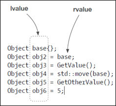
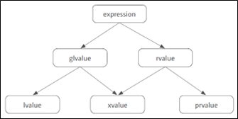
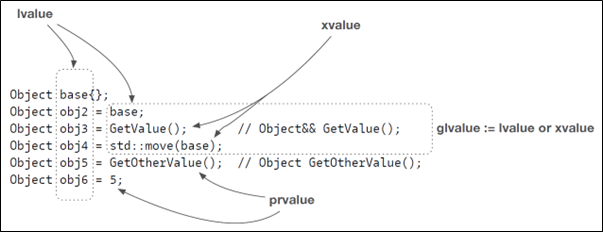
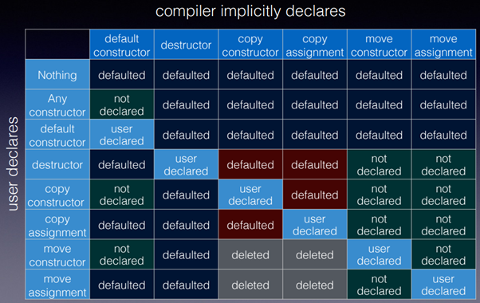

.. contents:: Table of Contents

Move Semantics
=================

std::move is only a cast. The overloads can move if they exist.

Temporary objects are picked up by default using move operations.

Only if we have an object we no longer want to use we can say std::move.

Move semantics is nothing else than an additional overload that is allowed and expected to steal data from a source object.

Overload
---------

Without rvalue reference
^^^^^^^^^^^^^^^^^^^^^^^^^

Before C++11, temporary values bind to const reference

.. code:: cpp

        #include <iostream>

        class S {
            int m_val;
           public:
            S(int val) : m_val(val) {}
            int get() const { return m_val; }
        };

        void fun(S& s) { 
            std::cout << "using ref, value: " << s.get() << '\n'; 
        }
        void fun(const S& s) {
            std::cout << "using const ref, value: " << s.get() << '\n';
        }

        int main() {
            S s1{1};        	fun(s1);
            const S s2{2};  fun(s2);
            fun(S{3});
            return 0;
        }

Output::

        using ref, value: 1
        using const ref, value: 2
        using const ref, value: 3

With rvalue reference
^^^^^^^^^^^^^^^^^^^^^^^^

Since C++11, temporary value is a pure rvalue and thus bind to rvalue reference 

.. code:: cpp

        #include <iostream>

        class S {
            int m_val;

           public:
            S(int val) : m_val(val) {}
            int get() const { return m_val; }
        };

        void fun(S& s) { 
            std::cout << "using ref, value: " << s.get() << '\n'; 
        }
        void fun(const S& s) {
            std::cout << "using const ref, value: " << s.get() << '\n';
        }
        void fun(S && s) {
            std::cout << "using rvalue ref, value: " << s.get() << '\n';
        }

        int main() {
            S s1{1};        	fun(s1);
            const S s2{2};  fun(s2);
            fun(S{3});
            return 0;
        }

Output::

        using ref, value: 1
        using const ref, value: 2
        using rvalue ref, value: 3

Triggering the rvalue overload
-------------------------------

To trigger rvalue reference manually

#. We may cast to rvalue explicitly
#. Use move (preferred)

So technically, std::move changes the value category changes and thus proper overload is called

.. code:: cpp

        #include <iostream>
        class S {
            int m_val;

           public:
            S(int val) : m_val(val) {}
            int get() const { return m_val; }
        };
        void fun(S& s) { 
            std::cout << "using ref, value: " << s.get() << '\n'; 
        }
        void fun(const S& s) {
            std::cout << "using const ref, value: " << s.get() << '\n';
        }
        void fun(S && s) {
            std::cout << "using rvalue ref, value: " << s.get() << '\n';
        }
        int main() {
            S s1{1};        	fun(s1);
            const S s2{2};  fun(s2);
            fun(S{3});

            std::cout << '\n'; 
            
            fun(static_cast<S&&>(s1));
            fun(std::move(s1));

            return 0;
        }

Output::

        using ref, value: 1
        using const ref, value: 2
        using rvalue ref, value: 3

        using rvalue ref, value: 1
        using rvalue ref, value: 1

The value categories
---------------------

Before C++11
^^^^^^^^^^^^^

 
Since C++11
^^^^^^^^^^^^^

A potential performance win
---------------------------

Ideally a move operation should not delete or free memory

.. code:: cpp

        #include <iostream>
        #include <utility>
        #include <memory>
        class S {
            std::unique_ptr<int> m_ptr;
           public:
            ~S() { std::cout << "~S() Dx\n"; }
            S(int val) : m_ptr(std::make_unique<int>(val)) { 
                std::cout << "S(int) Cx\n"; 
            }
            
            S(const S& other) : m_ptr(std::make_unique<int>(*(other.m_ptr))) { 
                std::cout << "const S & copy Cx\n"; 
            }
            S& operator=(const S& other) {

                if(&other != this) {    // avoid self assignment
                    m_ptr = std::make_unique<int>(*(other.m_ptr));
                    std::cout << "const S & copy assignment\n";
                }
                
                return *this;
            }

            S(S&& other) noexcept : m_ptr(std::exchange(other.m_ptr, nullptr)) { 
                // other.m_ptr is assigned 0 because we do not have any value to assign to it

                std::cout << "S && move Cx\n"; 
            }    
            S& operator=(S&& other) noexcept {
            
                if(&other != this) {
                    // different from move constructor to illusrate info about move
                    // this implementation using swap operations inside move
                    // no memory allocation
                    // no memory delete or free
                    // this implementation represent a constant operation
                    m_ptr = std::exchange(other.m_ptr, std::move(m_ptr));   

                    /*
                        this is another way of implementation of move
                        this is not a constant operation becoz it calls the destructor of other.m_ptr
                        
                        //m_ptr = std::move(other.m_ptr);    
                    */
                    std::cout << "S && move assignment\n";
                }
                
                return *this;
            }
            void display() { std::cout << "value is " << *m_ptr << '\n'; }
        };

        int main() {

            {
                std::cout << "=== copy constructor ===\n";
                S s1(5);
                s1.display();
                S s2(s1);
                s1.display();
                s2.display();
            }

            {
                std::cout << "=== copy assignment ===\n";
                S s1(5);
                S s2(15);
                s1.display();
                s2.display();
                s2 = s1;
                s1.display();
                s2.display();
            }
            {
                std::cout << "=== move constructor ===\n";
                S s1(5);
                S s2(std::move(s1));
                //s1.display();    // this is UB
                s2.display();
            }

            {
                std::cout << "=== move assignment ===\n";
                S s1(5);
                S s2(15);
                s1.display();
                s2.display();        
                s2 = std::move(s1);
                s1.display();   // this is UB
                s2.display();
            }

            return 0;
        }

Output::

        === copy constructor ===
        S(int) Cx
        value is 5
        const S & copy Cx
        value is 5
        value is 5
        ~S() Dx
        ~S() Dx
        === copy assignment ===
        S(int) Cx
        S(int) Cx
        value is 5
        value is 15
        const S & copy assignment
        value is 5
        value is 5
        ~S() Dx
        ~S() Dx
        === move constructor ===
        S(int) Cx
        S && move Cx
        value is 5
        ~S() Dx
        ~S() Dx
        === move assignment ===
        S(int) Cx
        S(int) Cx
        value is 5
        value is 15
        S && move assignment
        value is 15
        value is 5
        ~S() Dx
        ~S() Dx

A moved from object
--------------------

.. code:: cpp

        S	s1(6);
        S	s2(std::move(s1));
        auto res = s1.get();

After applying std::move, s1 becomes a moved-from object.

Such an object is in a valid, yet unknown state.

In general there are two types of move across programming languages:

#. destructive move
#. nondestructive move

C++ implements the nondestructive move.

The issue: Such an object is in a valid, yet unknown state.

- Before we can use such an object we must bring the object in a valid and known state.
- A moved from object must be at least destroyable and assignable.
- Every additional operation is up to the type author.

**Simple Rule: Never touch a moved from object.**

You know what you’re doing rule: You can reuse a moved from object once you brought the object back in a valid and known state. For all data types, assigning a new value to the moved from object is a safe operation.

STL, move, and custom object
----------------------------

In case when a container needs to reallocate memory when new elements are added to the container, it moves container elements from existing container to the new container

If move operations for the element may throw it fallback to copy operation for strong exception guarantee

If move operations does not throw it uses move operations

So, mark your move operations as noexcept to get better performance

.. code:: cpp

        #include <iostream>
        #include <vector>

        class S {
           public:
            ~S() { std::cout << "~S() Dx\n"; }
            S() { std::cout << "S() Cx\n"; }

            S(const S&) { std::cout << "const S & copy Cx\n"; }
            S& operator=(const S&) {
                std::cout << "const S & copy assignment\n";
                return *this;
            }

            /*
            // CASE-01
            S(S&&) { std::cout << "S && move Cx\n"; }
            S& operator=(S&&) {
                std::cout << "S && move assignment\n";
                return *this;
            }
            */
            // CASE-02
            S(S&&) noexcept { std::cout << "S && move Cx\n"; }
            S& operator=(S&&) noexcept {
                std::cout << "S && move assignment\n";
                return *this;
            }    
        };

        int main() {
            std::vector<S> vec;
            S s;
            vec.push_back(std::move(s));
            vec.push_back(S{});

            return 0;
        }

Output::

.. list-table::

    *   - CASE - 01
        - CASE - 02

    *   - | S() Cx
          | S && move Cx
          | S() Cx
          | S && move Cx
          | const S & copy Cx
          | ~S() Dx
          | ~S() Dx
          | ~S() Dx
          | ~S() Dx
          | ~S() Dx

        - | S() Cx
          | S && move Cx
          | S() Cx
          | S && move Cx
          | S && move Cx
          | ~S() Dx
          | ~S() Dx
          | ~S() Dx
          | ~S() Dx
          | ~S() Dx

std::move is not always the right thing
-----------------------------------------

move is not always the right operation; developer should be careful when using move operation on a variable

- move should not be used on reference variable
- because reference is an alias to a variable, and it will leave original passed value in unknown state
- move on a universal reference is also problematic because it also moves lvalues passed to it

In general, move a value only when you own it

.. code:: cpp

        #include <iostream>
        #include <string>

        void passAsRefAndMove(std::string & sval) {
            // move should not be used on reference varibale
            // because refernce is an alias to a varible, and it will leave original passed value in unknown state 
            std::string local_str = std::move(sval);
            std::cout << "inside " << __func__ << ", string value is: " << local_str << '\n';
        }

        template<typename T>
        void passAsUniversalRefAndMove(T && sval) {
            // move on a universal reference is also problmetic because it also moves lvalues passed to it
            std::string local_str = std::move(sval);
            std::cout << "inside " << __func__ << ", string value is: " << local_str << '\n';
        }

        template<typename T>
        void passAsUniversalRefAndForward(T && sval) {
            // forward is the right operation on a univeral reference
            std::string local_str = std::forward<T>(sval);
            std::cout << "inside " << __func__ << ", string value is: " << local_str << '\n';
        }

        int main() {
            {
                std::string str = "A string which will require heap allocation";
                passAsRefAndMove(str);
                std::cout << "inside " << __func__ << ", string value is: " << str << '\n';
            }
            {
                std::string str = "A string which will require heap allocation";
                passAsUniversalRefAndMove(str);
                std::cout << "inside " << __func__ << ", string value is: " << str << '\n';
            }
            {
                std::string str = "A string which will require heap allocation";
                passAsUniversalRefAndForward(str);
                std::cout << "inside " << __func__ << ", string value is: " << str << '\n';
            }

            return 0;
        }

Output::

        inside passAsRefAndMove, string value is: A string which will require heap allocation
        inside main, string value is: 
        inside passAsUniversalRefAndMove, string value is: A string which will require heap allocation
        inside main, string value is: 
        inside passAsUniversalRefAndForward, string value is: A string which will require heap allocation
        inside main, string value is: A string which will require heap allocation

Move or forward
----------------

.. list-table::

    *   - Signature
        - Action

    *   - void Fun(Object p);
        - x = std::move(p);

    *   - template<class T> void Fun(T&& p);
        - x = std::forward<T>(p);
          
    *   - Object o{/* \*/};
        - x = std::move(o);
          
    *   - auto&& o{/* \*/};
        - x = std::forward<decltype(o)>(o);

Use std::forward when you have a template parameter for the thing you want to pass around efficiently.

Use std::move only if the above does not apply, you have a fixed type, and the type is not a reference.

Perfect forwarding
-------------------

Make in following example is taking U && as parameter which is an universal reference

Because it might be a lvalue or and rvalue

.. code:: cpp

        #include <iostream>
        #include <string>

        class S {
            public:
            S(const std::string & str) {
                std::cout << "lvalue: " << str << '\n';
            }
            S(std::string && str) {
                std::cout << "rvalue: " << str << '\n';
            }    
        };

        template<typename T, typename U>
        auto make(U&& val) {
            return T(std::forward<U>(val));
        }

        int main() {
            std::string str("sample string");
            
            S s1(make<S>(str));
            S s2(make<S>(std::move(str)));
            S s3(make<S>(std::string("temporary string")));

            return 0;
        }

Output::

        lvalue: sample string
        rvalue: sample string
        rvalue: temporary string

Use move only rarely
----------------------

In general, the compiler is our friend.

Temporary objects are automatically moved.

For return values, the compiler might apply optimizations such as copy elision. You don’t beat copy elision with move! So, don’t move return values

Compiler optimizations are much better than move can be

Move should be used with only for objects which are very expansive to create

Compiler Generated Special Members
------------------------------------

Writing our own move copy/assignment deletes the compiler copy operations
Writing move constructor, compiler does not declare the default constructor
Writing destructor, move operations are not provided by compiler you need to write your own

 
Reference
https://accu.org/conf-docs/PDFs_2014/Howard_Hinnant_Accu_2014.pdf

Utilizing move semantics even more: refqualifiers
-------------------------------------------------

.. code:: cpp

        #include <iostream>
        #include <string>

        class S {
            public:
            ~S() { std::cout << "Dx\n"; };
            S() { std::cout << "Cx\n"; };

            S(const S &) { std::cout << "Copy Cx\n"; };
            S& operator=(const S &) { std::cout << "Copy =\n"; return *this; };

            S(S &&) { std::cout << "Move Cx\n"; };
            S& operator=(S &&) { std::cout << "Move =\n"; return *this; };

            S operator+(const S &) { std::cout << "operator+\n";  return *this; }
        };

        class Data {
            S m_s;
            public:
            Data(S s) : m_s(s) { }

            /*
            // CASE - 01
            Data & append(const S & s) {
                m_s = m_s + s;
                return *this;
            }
            */

            // CASE - 02
            Data & append(const S & s) & {
                m_s = m_s + s;
                return *this;
            }

            Data && append(const S & s) && {
                m_s = m_s + s;
                return std::move(*this);
            }
        };

        int main() {
            {
            Data d{S{}};
            d.append(S{});
            }

            {
                std::cout << "===\n";
                // for CASE-02 this will use move instaead of copy
                Data d = Data(S{}).append(S{});
            }

            return 0;
        }

Output

.. list-table::

    *   - CASE – 01
        - CASE – 02

    *   - 
                | Cx
                | Copy Cx
                | Dx
                | Cx
                | operator+
                | Copy Cx
                | Move =
                | Dx
                | Dx
                | Dx
                | ===
                | Cx
                | Copy Cx
                | Cx
                | operator+
                | Copy Cx
                | Move =
                | Dx
                | Copy Cx
                | Dx
                | Dx
                | Dx
                | Dx

        - 
                | Cx
                | Copy Cx
                | Dx
                | Cx
                | operator+
                | Copy Cx
                | Move =
                | Dx
                | Dx
                | Dx
                | ===
                | Cx
                | Copy Cx
                | Cx
                | operator+
                | Copy Cx
                | Move =
                | Dx
                | Move Cx
                | Dx
                | Dx
                | Dx
                | Dx

References
----------

`Back to Basics: C++ Move Semantics - Andreas Fertig - CppCon 2022 <https://www.youtube.com/watch?v=knEaMpytRMA>`_

