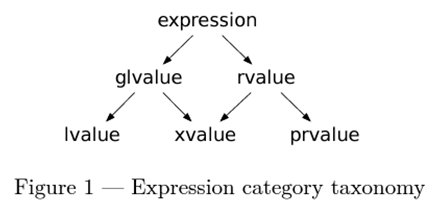
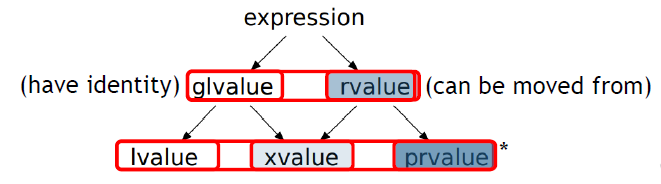

.. contents:: Table of Contents

Motivation
-----------

Compiler can steal data from temporaries 

To explicitly steal data from object use std::move()

Wrong uses of std::move() may lead to performance overhead and may not result in what we intended

.. code:: cpp

	#include <iostream>
	#include <string>

	class LearnValueCategories {
	  std::string     m_data;
	  public:
	  ~LearnValueCategories() { 
		  std::cout << "Destructor\n";
	  }
	  LearnValueCategories(std::string data) : m_data(data) { 
		  std::cout << "Constructor\n";
	  }
	  LearnValueCategories(const LearnValueCategories & other) 
		  : m_data(other.m_data) {
		  std::cout << "Copy Constructor\n";
	  }
	  LearnValueCategories(LearnValueCategories && other) 
		  : m_data(std::move(other.m_data)) {
		  std::cout << "Move Constructor\n";
	  }
	};

	LearnValueCategories getValueCategories() {
	  return LearnValueCategories("returning LearnValueCategories value");
	}

	const LearnValueCategories getValueCategories_Const() {
	  return LearnValueCategories("returning const LearnValueCategories value");
	}

	int main() {
	  std::cout << "=== Constructing and moving object ===\n";
	  {   LearnValueCategories lv("constructor"); }           // 1 object created
	  std::cout << '\n';
	  {   LearnValueCategories lv1("this will be moved");     // 1 object created
		  LearnValueCategories lv2 = std::move(lv1);          // 0 object created
	  }

	  std::cout << "=== Constructing object using return value ===\n";
	  {
		  LearnValueCategories lv = getValueCategories();     // 1 object created
	  }
	  std::cout << '\n';
	  {
		  LearnValueCategories lv = getValueCategories_Const();   // 1 object created
	  }
	  std::cout << "=== Constructing object using return value and moving ===\n";
	  {
		  LearnValueCategories lv = std::move(getValueCategories());      // 1 object created
	  }
	  std::cout << '\n';
	  {
		  LearnValueCategories lv = std::move(getValueCategories_Const());    // 2 object created
	  }

	  return 0;
	}

Output::

	=== Constructing and moving object ===
	Constructor
	Destructor

	Constructor
	Move Constructor
	Destructor
	Destructor
	=== Constructing object using return value ===
	Constructor
	Destructor

	Constructor
	Destructor
	=== Constructing object using return value and moving ===
	Constructor
	Move Constructor
	Destructor
	Destructor

	Constructor
	Copy Constructor
	Destructor
	Destructor

Intro to Value Categories
--------------------------

What are value Categories
^^^^^^^^^^^^^^^^^^^^^^^^^^

Value Categories were inherited from C

C has "lvalue expression"

Originally it referred to the location of the expression in assignment statement

.. code:: cpp

    int val = 42;

- **lvalue** (left-value) was on the left of the assignment 
- **rvalue** (right-value) was on the right of the assignment 

|
|

Value Category of an entity defines:

#. Its lifetime :

   - Can it be moved from
   - Is it a temporary
   - Is it observable after change, etc.

#. Its identity:

   - Object has identity if its address can be taken and used safely

Value Categories affect two very important aspects relevant to libraries:

#. Performance
#. Overload resolution

Value Category is a **quality of an expression**

.. code:: cpp

	class Data {
	  int     m_val;
	  public:
	  Data(int val) : m_val(val) { }
	};

	void fun(Data && data) {
	  data = 10;
	}

	int main() {
	  Data && data_v = 11;  // OK
	  fun(data_v);          // CE, data_v is lvalue
	  fun(Data(12));        // OK
	  return 0;
	}

What (misleadingly) looks like the value category, can in fact be the type

- data_v’s Type: rvalue reference to Data
- data_v’s Value Category: lvalue

|
|

What (misleadingly) looks like the same entity, is, in fact, not!

**The entity can have different VC in different contexts**

During a function call:

- Step I : Calls constructor, creates an unnamed temp Data(12)
- Step II : 'Data(12)' binds to the rvalue reference data
- Step III : The entity which used to be 'Data(12)' has a name data, therefore, **in the scope of fun(), data is now an lvalue**

Each expression has two properties:

#. A type (including CV qualifiers)
#. A value category

Introduced in: `N3055 <http://www.open-std.org/jtc1/sc22/wg21/docs/papers/2010/n3055.pdf>`_ : A Taxonomy of Expression Value Categories (William M. Miller, 2010)

Value Categories changed throughout C++ versions, affected by the rules defining references , move semantics and copy elision

Evolution of value Categories
^^^^^^^^^^^^^^^^^^^^^^^^^^^^^^

**C language**

Three types of expressions:

- lvalue expression
- Non lvalue object expression
- Function designator expression

**C++98: added lvalue references**

Expression is either an lvalue or an rvalue

- lvalue : Objects, Functions, References
- rvalue : Non-lvalue (can be bound by const lvalue reference)

**C++03**

- No significant change

**C++11: added rvalue references, move semantics**

.. list-table::
	header-rows: 1

	*	-
		- Has Identity (glvalue)
		- Doesn’t have identity
		
	*	- Can’t be moved from
		- lvalue
		- 
		
	*	- Can be moved from (rvalue)
		- xvalue
		- prvalue
		
**C++17: Added guaranteed copy elision**

.. list-table::
	header-rows: 1

	*	-
		- Has Identity (glvalue)
		- Doesn’t have identity
		
	*	- Can’t be moved from
		- lvalue
		- 
		
	*	- Can be moved from (rvalue)
		- xvalue
		- prvalue’s materialization

"The result of a prvalue is the value that the expression stores into its context"
	
**C++20**

[N4861] (March 2020)

- `P0527 <https://www.open-std.org/jtc1/sc22/wg21/docs/papers/2018/p0527r1.html>`_ : Implicitly move from rvalue references in return statements (David Stone)
- Editorial: Moved Value Categories section from [basic] to [expt]
	
[N4868] (Oct 2020)

- Removed “bit field” from the value categories primary definitions

**C++23 draft (latest):**

- `P0847 <https://www.open-std.org/jtc1/sc22/wg21/docs/papers/2021/p0847r7.html>`_ : Deducing this Gašper Ažman , Sy Brand, Ben Deane, Barry Revzin
- P0847 also added like_t
- `P2445 <https://www.open-std.org/jtc1/sc22/wg21/docs/papers/2021/p2445r0.pdf>`_ : std::forward_like

**Main Categories (classification only)**

- glvalue : expression whose evaluation determines the identity of an object or function
- rvalue : a prvalue or an xvalue

**Subcategories**

- lvalue : glvalue that is not an xvalue
- xvalue : glvalue that denotes an object whose resources can be reused (usually because it is near the end of its lifetime)
- prvalue : expression whose evaluation initializes an object, or computes the value of the operand of an operator, as specified by the context in which it appears, or an expression that has type cv void

Examples
~~~~~~~~~~

**Lvalue** lvalue is something that have an identity

.. code:: cpp

	struct Data { int n; int pn = n; };
	Data& getData (Data& d) { return d }

	int a = 42;			// a is lvalue
	int b = a;			// b is lvalue

	int& iref = a;		// iref is lvalue
	int* iptr = &a;		// iptr is lvalue

	int&& ra = 42;
	a++;
	++a;				// ++a is lvalue

	int arr[] = {1, 2, 3};	// arr[] is lvalue
	arr[0] = 73;			// arr[0] is lvalue

	Data d;				// d is lvalue
	(&d)->n = 42;		// (&d)->n is lvalue
	d.n = 73;			// d.n is lvalue
	*d.pn = 42;			// *d.pn is lvalue

	string s ="Hello World";	// s is lvalue
	a==b ? b : c;		// is lvalue when b and c are lvalues

	Data c = getData(d);	// return value of function that creates c is lvalue

.. note::

ra has the type: rvalue reference to int, with the value category: lvalue
	

**prvalue**

.. code:: cpp

	struct Data {
		int n;
		int foo() { this->n = 4 ; }	// this is prvalue, 4 is prvalue
	};

	int a = 42;		// 42 is prvalue

	int* pa = &a;	// &a is prvalue
	pa = nullptr;	// nullptr is prvalue

	a++;			// built-in post increment a++ is prvalue
	++a;

	auto l = { return 2 ;};	// lambda { return 2 ;} is prvalue

	Data d;
	Data* dp = &d;

	Data();

	d->n = 6;		// 6 is prvalue
	d.n	 = 6;		// 6 is prvalue

	string s ="Hello World";	

	a==a ? throw 4 : throw 2;	// throw is prvalue void
	bool equals = a==42;	// a==42 is prvalue

**xvalue**

.. code:: cpp

	struct Data { int n; int* pn = &n; };
	Data d1 = Data(42);		// Data(42) is xvalue
	d1.*pn = 73;

	Data d2 = std::move(d1);	// std::move(d1) is xvalue

	// Data().n is xvalue, because in order to get n we need to create the object even if its temporary
	Data().n;				// Data().n is xvalue

	Data getData () {
		return Data(73);
	}

	Data d3 = getData();		// function return value is xvalue
	d1==d2 ? Data(42) : Data(73);	// return value of ternary is xvalue

Value Categories In Practice
-------------------------------

Intro to Overload resolution
^^^^^^^^^^^^^^^^^^^^^^^^^^^^^^

Overload resolution of functions affected by value Categories

To Compile a function call, compiler creates list of candidates, then finds correct Overload

**Overload resolution**

- Picking the correct function from group of candidates
- Function candidates are picked according to function name (Name lookup)
- May include Template Argument Deduction (TAD) and Argument Dependent Lookup (ADL)

**Template Argument Deduction (TAD)**

- Value category of an expression affects type deduction
- Involves non-trivial deduction rules (out of scope) 
  (e.g. deduction of T from multiple parm with different value categories) 
  
The details of binding
^^^^^^^^^^^^^^^^^^^^^^^^

Expressions with different Value Categories bind ” to different types of References

The Reference type which binds the expression determines the permitted operations

Binding rules are important for

#. Initialization or assignment
#. Function call (including non static class member function called on an object)
#. Return statement

.. code:: cpp

	int main() {
		int val = 5;

		int&            ref     = val;
			        ref     = 65;
		const int&      cref    = val;
				cref    = 67;       // CE

		int&&           rref    = val + 75;
				rref    = 68;      
		const int&&     crref   = val + 80;
				crref   = 75;       // CE

	}
	
	
1. Initialization Or Assignment
~~~~~~~~~~~~~~~~~~~~~~~~~~~~~~~~~

Rule

.. list-table::
	header-rows: 1

	*	- 
		- Binds lvalues?
		- Binds rvalues?
		
	*	- lvalue reference
		- ✓
		- ❌
		
	*	- const lvalue reference
		- ✓
		- ✓

	*	- rvalue reference
		- ❌
		- ✓
		
	*	- const rvalue reference
		- ❌
		- ✓

.. code:: cpp

	int main() {
		int val = 5;

		int&        ref1     = val;
		int&        ref2     = 10;        // CE

		const int&  cref1    = val;
		const int&  cref2    = 20;

		int&&       rref1    = val;       // CE
		int&&       rref2    = val + 75;

		const int&& crref1   = val;       // CE
		const int&& crref2   = val + 80;

	}

The Lifetime of an object can be extended by binding to references:

const lvalue reference : extends lifetime of an object (not allowing modification)
rvalue reference : extends lifetime of a temporary objects

2. Function Call
~~~~~~~~~~~~~~~~~~~~~~

.. code:: cpp

	class Data {
		int     m_val;
		
		public:
		Data(int val) : m_val(val) { }
	};

	void fun(Data & ) { }           // 1
	void fun(const Data & ) { }     // 2
	void fun(Data && ) { }          // 3
	void fun(const Data && ) { }    // 4

	const Data getData(int x) {
		return Data(x);
	}

	int main() {
		Data data(5);

		Data&       lval_ref    = data;
		const Data& clval_ref   = data;

		fun(lval_ref);      // lvalue: 1, 2
		fun(clval_ref);     // const lvalue: 2

		Data&&          rval_ref    = Data(55);
		const Data&&    crval_ref   = Data(55);

		fun(rval_ref);      // lvalue: 1, 2
		fun(crval_ref);     // const lvalue: 2

		fun(Data(11));      // xvalue: 3, 4, 2
		fun(getData(12));   // const xvalue: 4, 2

	}

Limitations on the object in the context of the function are according to the binding function

.. list-table::
	header-rows: 1

	*	- 
		- Function can modify data?
		- Caller can observe (old) data?
		
	*	- lvalue reference
		- ✓
		- ✓
		
	*	- const lvalue reference
		- ❌
		- ✓

	*	- rvalue reference
		- ✓
		- ❌
		
		
	*	- const rvalue reference
		- ❌
		- ❌

Non-static member functions behave similarly

**deleted const rvalue reference overload will block rvalue binding**

Copy elision optimizations
^^^^^^^^^^^^^^^^^^^^^^^^^^^

3. Return Statement
~~~~~~~~~~~~~~~~~~~~~

- Starting from C++17, the behavior of VCs is affected by:
  "P0135 : Guaranteed copy elision (…)"
  
- There are two mandatory elisions of copy and move constructors:

  1. Object initialization
  
  .. code:: cpp
  
	Data d = Data(Data(42));	// 1 CTOR (avoids: CTOR, Copy CTOR)
	
  2. Return statement:
  
  An unnamed Return Value Optimization (RVO): 
  .. code:: cpp
  
	Data getData int x){ return Data(x); }
	Data d = getData(42);		// 1 CTOR (avoids: CTOR, Move CTOR)
	

No change in non mandatory Named Return Value Optimization (NRVO)

.. code:: cpp

	Data getData int x){ Data d(x) return d; }
	Data d = getData(42);		// 1 CTOR (avoids: CTOR, Move CTOR)
	
Return Statement: Materialization
~~~~~~~~~~~~~~~~~~~~~~~~~~~~~~~~~~

Temporary materialization conversion [conv.rval]
A prvalue of type T can be converted to an xvalue of type T.
This conversion initializes a temporary object of type T from the prvalue by evaluating the prvalue with the temporary object as its result object, and produces an xvalue denoting the temporary object
[in order to materialize] T shall be a complete type.

.. code:: cpp

	Data getData(int x){ return Data(x); }
	Data d = getData(42);

1. prvalue of type Data
2. Temp data evaluating prvalue
3. Produces an xvalue

.. code:: cpp

	Data getData int x){ Data d(x) return d; }
	Data d = getData(42);
	
1. lvalue of type Data
2. lvalue initializes temp data
3. Produces an xvalue

Return Statement: const vs non const
~~~~~~~~~~~~~~~~~~~~~~~~~~~~~~~~~~~~

.. code:: cpp

	Data getData int x){ return Data(x); }
		
	Data		data		= getData(13);	// lval (no temporary, RVO)
	Data&		ref_data	= getData(13);	// Error: xval -> non const lval ref
	const Data&	cref_data	= getData(13);	// xval -> const lval ref (extends lifetime)
	Data&&		rref_data	= getData(13);	// xval -> rval ref  (extends lifetime)

	
.. code:: cpp

	const Data getData int x){ return Data(x); }	

	
	Data			data		= getData(13);	// lval (no temporary, RVO)	
	Data&			ref_data	= getData(13);	// Error: const xval -> non const lval ref
	const Data&		cref_data	= getData(13);	// const xval -> const lval ref (extends lifetime)
	Data&&			rref_data	= getData(13);	// Error: const xval -> rval ref
	const Data&&	crref_data	= getData(13);	// const xval -> const rval ref (extends lifetime)
	
	
Vlaue Categories in Generic Code
---------------------------------

Template instantiation and overload resolution are affected by the value category of the expression

When a function template participates in overload resolution, Template Argument Substitution Occurs

Template arguments can be affected by lvalue-to-rvalue, array-to-pointer, or function-to-pointer implicit conversion (as in auto)

Reference collision
^^^^^^^^^^^^^^^^^^^^^^

In case of concatenation of multiple ‘&’ symbols:

- In generic code
- In code using type aliases

Compiler performs Reference Collision:

.. code:: cpp

	typedef int&    lvalue_ref_t;
	typedef int&&   rvalue_ref_t;

	template<typename T>
	void fun(T t) { }

	template<>
	void fun(lvalue_ref_t t) { }    //  lvalue_ref_t -> int&

	template<>
	void fun(lvalue_ref_t& t) { }   // lvalue_ref_t&    -> int&&    -> int&

	int main() {
		int     val = 5;

		lvalue_ref_t&   lref    = val;  // lvalue_ref_t&    -> int&&    -> int&
		lvalue_ref_t&&  rref    = val;  // lvalue_ref_t&&   -> int&&&   -> int&

		rvalue_ref_t&   rref1   = val;  // rvalue_ref_t&    ->  int&&&  -> int&
		rvalue_ref_t&&  rref2   = 72;   // rvalue_ref_t&&   ->  int&&&& -> int&&

		return 0;
	}

Forwarding reference	
^^^^^^^^^^^^^^^^^^^^^^

Forwarding parameters inside a function template should consider Value Categories

The term for them was first suggested by Scott Myers, “universal reference”

Later formalized as "forwarding reference" [temp.deduct.call]

Due to TAD, “ rvalue reference” has a special meaning in context of function template:

T&& keeps the value category of the type the instantiation is based on

Type is deduced in order to keep the value category of the expression

.. code:: cpp

	template<typename T>
	void fun(T&& t) { }

	int main() {
		int val = 5;
		const int & cref = val;
		int&& rref = 13;

		fun(val);               // T&&  -> int&&        -> T = int&
		fun(cref);              // T&&  -> const int&&  -> T = const int&
		fun(std::move(val));    // T&&  -> int&&        -> T = int
		auto && uref = rref;    // T&&  -> int&&        -> T = int&
		
	}

Part IV: Tools for handling value categories
--------------------------------------------

when template function is considered for overload resolution, Template Argument Substitution occurs

Standard library and language provide different methods for querying and adjusting value category
Following type_traits are example

.. code :: cpp

	std::is_lvalue_reference<T>
	std::is_rvalue_reference<T>

Follwing section will use type traits, decltype and overload resolution to determine value category

- decltype specifier
- std::move
- std::forward
- std::decay
- std::remove_reference
- std::declval
- std::is_same

decltype specifier
^^^^^^^^^^^^^^^^^^^

.. code:: cpp

	decltype(expression)
	
Evaluates an expression , yields its type + value category (AKA the declared

decltype (unlike auto) preserves value category. For an expression of type T, 

If expression is

xvalue,		yields	T&&

lvalue,		yields	T&

prvalue,	yields	T	

Can be used instead of a type, as a placeholder which preserves value categories

.. code:: cpp

	int fun(int i) {
		return std::move(i);
	}

	int	i = 73;
	auto a = fun(i);		// Type: int | VC: lvalue
	decltype (auto) b = fun(i);	// Type: rvalue ref | VC: lvalue 

The fine print:

- The T prvalue doesn’t materialize, so T can be an incomplete type (C++17)
- If evaluation fails (entity is not found or overload resolution fails), program is ill formed

**((expression)) has a special meaning, and yields an lvalue expression**

.. code:: cpp

	int&& a = 42;
	decltype(a) b = 42;		// Type: rvalue ref to int | VC: lvalue
	decltype((a)) c = 73;	// Error! Binding non const lvalue ref to prvalue

Use Case
~~~~~~~~~~

1. When the type is unknown (syntax is available from C++14)

.. code:: cpp

	template <typename T, typename U>
	decltype(auto) Add(T t, U u) {
		return t + u;
	};

	template typename T>
	decltype(auto) Wrapper(T&& t) {
		// do something...
		return std::forward<T>(t);
	};

2. To preserve the value category of the expression

.. code:: cpp

	int a = 42;		// Type: rvalue ref to int | VC: lvalue
	decltype(a) b = a;	// Error! (binding rvalue ref to an lvalue ref a)
	decltype(a) c = 73;	// Type: rvalue ref to int | VC: lvalue
	decltype((a)) d = a;	// Type: lvalue ref to int | VC: lvalue

std::move
^^^^^^^^^^^^^

.. code:: cpp

	std::move(expression);

Utility function, produces an xvalue expression T&&

Equivalent to static_cast to a T rvalue reference type

.. code:: cpp

	static_cast<typename std::remove_reference <T>::type&&>(t);

std::move may not always do what you hoped

.. code:: cpp

	void fun(int& x) {
		cout << "int&";
	}
	void fun(const int& x) {
		cout << "const int&";
	}
	void fun(int&& x) {
		cout << "int&&";
	}

	int main() {
		int a = 73;
		int b = a;
		const int c = a;
		const int d = 42;
		fun(std::move(b));  // int&&        ->  fun(int&&)
		fun(std::move(c));  // const int&   ->  fun(const int&)
		fun(std::move(d));  // const int&&  ->  fun(const int&)
	}

std::forward
^^^^^^^^^^^^^

.. code:: cpp

	std::forward<T>(expression);

Suggested utility function, **preserves value category of the object passed to the template**

std::forward uses std::remove_reference<T> to get the value type

Commonly used combined with forwarding reference

.. code:: cpp

	#include <iostream>

	void fun(int& x) {
		std::cout << "int& \n";
	}
	void fun(const int& x) {
		std::cout << "const int& \n";
	}
	void fun(int&& x) {
		std::cout << "int&& \n";
	}

	template<typename T>
	void forward_wrapper(T&& t) {
		fun(std::forward<T>(t));
	}

	template<typename T>
	void no_forward_wrapper(T&& t) {
		fun(t);
	}

	int main() {
		int a = 73;
		const int & cref = a;

		forward_wrapper(a);         // int&
		no_forward_wrapper(a);      // int&

		forward_wrapper(cref);      // const int&
		no_forward_wrapper(cref);   // const int&

		forward_wrapper(5);         // int&&
		no_forward_wrapper(5);      // int&

	}

Output::

	int& 
	int& 
	const int& 
	const int& 
	int&& 
	int& 

std::decay
^^^^^^^^^^^^^

.. code:: cpp

	std::decay<T>::type;
	std::decay_t<T>;
	
Performs the following conversions:

#. Array to pointer
#. Function to function pointer
#. lvalue to rvalue (removes cv qualifiers, references) (issue for move only types)

It resembles "auto"s behavior ("auto" performs auto decay)

.. code:: cpp

	template<typename T, typename U>
	struct decay_is_same 
		: std::is_same typename std::decay<T>::type, U>
	{};

	decay_is_same<int&, int >::value; // true

std::remove_reference
^^^^^^^^^^^^^^^^^^^^^^

.. code:: cpp
	
	std::remove_reference<T>::type;
	std::remove_reference_t<T>;
	

If the type T is a reference type, 
	provides the member typedef type which is the type referred to by T. 
Otherwise type is T.

.. code:: cpp

	#include <iostream>
	#include <type_traits>
	 
	int main() {
		std::cout << std::boolalpha;
	 
		std::cout << "std::is_same_v<int, std::remove_reference_t<int>> "
				  << std::is_same_v<int, std::remove_reference_t<int>> << '\n';
		std::cout << "std::is_same_v<int, std::remove_reference_t<int&>> "
				  << std::is_same_v<int, std::remove_reference_t<int&>> << '\n';
		std::cout << "std::is_same_v<int, std::remove_reference_t<int&&>> "
				  << std::is_same_v<int, std::remove_reference_t<int&&>> << '\n';
		std::cout << "std::is_same_v<const int, std::remove_reference_t<int>> "
				  << std::is_same_v<const int, std::remove_reference_t<const int&>> << '\n';
	}

Output::

	std::is_same_v<int, std::remove_reference_t<int>> true
	std::is_same_v<int, std::remove_reference_t<int&>> true
	std::is_same_v<int, std::remove_reference_t<int&&>> true
	std::is_same_v<const int, std::remove_reference_t<int>> true

std::declval
^^^^^^^^^^^^^

.. code:: cpp

	std::declval<T>;
	
Utility function, produces:

	- xvalue expression T&&
	- If T is void, returns T
	
Can be used with expression to return the expression’s reference type

**Can return a non constructible or incomplete type**

.. code:: cpp

	struct Type {
		int a;
		int Foo() { return 42; }

	   private:
		Type() {}
	};

	int main() {
		Type t;                          // CE
		typeid(declval<Type>()).name();  // type
	}

Combined with decltype, can get the type of a member (even when Type is non constructible)

.. code:: cpp

	decltype(declval<Type>().a) b = 73;

Shouldn’t be used in an evaluated context (evaluating std::decltype is an error)

**std::declval allows us to access T members, in a way preserves value categories**

.. code:: cpp

	#include <utility>

	struct Type {
		int a;
		int ra = a;
		int getA() { return int(73); }
		int getRefA() { return ra; }

	   private:
		Type(int i) : a(int (i)) {}
	};

	int main() {
		std::declval<Type>().a;         // xvalue
		std::declval<Type>().ra;        // lvalue
		std::declval<Type>().getA();    // prvalue
		std::declval<Type>().getRefA(); // lvalue
	}

decltype and declval are often used to transform between type and instance, for example:

.. code:: cpp

	template<typename Derived>
	using begin_adaptor_t = detail::decay_t<(decltype(
		range_access::begin_adaptor(std::declval<Derived &>()))>;
		
		

std::is_same
^^^^^^^^^^^^^

.. code :: cpp

	std::is_same<T, U>::value;
	std::is_same_v<T, U>::value;
	
Can be used to evaluate equality, including the value category of the expression

.. code:: cpp

	std::is_same_v<int, int>;			// true
	std::is_same_v<int&, int>;			// false
	std::is_same_v<decltype(a), int>;	// true
	
	template<typename T, typename U>
	struct remove_reference_is_same : 
			std::is_same<typename std::remove_reference_t<T>, U> 
	{ };
	
	

Advanced Utilities
^^^^^^^^^^^^^^^^^^^^

- std::reference_wrapper
- std::ref, std::cref
- std::unwrap_reference	(since C++20)
- Concepts		(since C++20)
- auto cast		(since C++23)
- Deducing this		(since C++23)

std::reference_wrapper
^^^^^^^^^^^^^^^^^^^^^^^^

.. code:: cpp

	std::reference_wrapper<T>;
	
Functional helper, produces lvalue expression which can be used in same places as a reference

std::reference_wrapper provides extra safety of avoiding dangling reference

can be used to create a container of objects of non-constructible or incomplete types

std::ref and std::cref are often used to generate std::reference_wrapper objects

std::reference_wrapper is also used to pass objects by reference	

.. code:: cpp

        #include <iostream>
        #include <type_traits>
        #include <array>
        #include <vector>

        class Type {
                int a;
                Type(int val) : a(val) {}
                
                public:
                friend Type getType(int i);

                friend std::ostream & operator<<(std::ostream & os, const Type & t) {
                        std::cout << t.a;
                        return os;
                }
        };

        Type getType(int i) {
                return Type(i);
        }

        int main() {
                std::array  larr = {getType(1), getType(2), getType(3), getType(4), getType(5)};
                std::vector<std::reference_wrapper<Type>>   vec(larr.begin(), larr.end());
                std::cout << "vec.at(0): " << vec.at(0) << '\n';
                std::cout << "vec.at(4): " << vec.at(4) << '\n';
        }

Output::

	vec.at(0): 1
	vec.at(4): 5

std::ref, std::cref
^^^^^^^^^^^^^^^^^^^^^

Function helper, takes an lvalue reference to object (overload (const) rvalue reference is deleted)

Produces an object of type std::reference_type

Sarting from C++20, T may be incomplete type

.. code:: cpp

	#include <iostream>
	#include <type_traits>
	#include <array>
	#include <vector>

	class Type {
		int a;
		Type(int val) : a(val) {}
		
		public:
		friend Type getType(int i);

		friend std::ostream & operator<<(std::ostream & os, const Type & t) {
			std::cout << t.a;
			return os;
		}
	};

	Type getType(int i) {
		return Type(i);
	}

	template<typename T>
	void require_ref(T t) {
		std::cout << "Inside require_ref: " << t << '\n';
	}

	int main() {
		std::array  larr = {getType(1), getType(2), getType(3), getType(4), getType(5)};
		std::vector<std::reference_wrapper<Type>>   vec;
		vec.push_back(std::ref(larr.at(0)));
		vec.push_back(std::ref(larr.at(1)));
		vec.push_back(std::ref(larr.at(2)));
		vec.push_back(std::ref(larr.at(3)));
		vec.push_back(std::ref(larr.at(4)));

		std::cout << "vec.at(0): " << vec.at(0) << '\n';
		std::cout << "vec.at(4): " << vec.at(4) << '\n';

		int a = 15;
		require_ref(a);
		require_ref(std::ref(a));
		require_ref(std::cref(a));
	}

Output::

	vec.at(0): 1
	vec.at(4): 5
	Inside require_ref: 15
	Inside require_ref: 15
	Inside require_ref: 15

std::unwrap_reference	(since C++20)
^^^^^^^^^^^^^^^^^^^^^^^^^^^^^^^^^^^^^^^

.. code:: cpp

	std::unwrap_reference<T>::type;
	std::unwrap_reference_t<T>;

Produces Type

If T is std::reference_wrapper<U> for some type U, 
	type is  U&; 
otherwise, 
	type is T
	
.. code:: cpp

        std::unwrap_ref_decay<T>::type;
	std::unwrap_ref_decay<T>;
	
If T is std::reference_wrapper<U> (possibly CV qualified) for some type U, 
	type is  U&; 
otherwise, 
	type is std::decay_t<T>

Concepts        (since C++20)
^^^^^^^^^^^^^^^^^^^^^^^^^^^^^^^

.. code:: cpp

	tempplate<Concept T>
	auto fun(T t);

Concepts can be used to constraint the value category of the entity acceptable in an algorithm

Example Library Concepts:

**std::move_constructible**

Concept is satisfied if:

- T is a reference type
- T is an object type which can be constructed from a T rvalue

**std::movable**

Concept is satisfied if:

T is an object, which also satisfies 
std::move_constructible<T>
assignable_from<T& T> (using std::is_lvalue_reference, std::forward etc.)
std::swappable<T>

These as well as the <type_traits> are available for constructing our own concepts

auto cast	(since C++23)
^^^^^^^^^^^^^^^^^^^^^^^^^^^^^^^

Result is a prvalue of an object type(discards CV qualifier)

can also be used combined with "decltype"

int a = 42;		// lvalue (int)
auto & b = a;	// lvalue (int&)
auto c(b);		// lvalue (int&)
auto(c);		// prvalue

Deducing this	(since C++23)
^^^^^^^^^^^^^^^^^^^^^^^^^^^^^^^

.. code:: cpp

	tempplate<typename T>
	auto fun(this T&& t);

Allows specifying from within a member function the value category of the expression it’s invoked on

.. code:: cpp

	struct Type {
		// pre C++23
		auto fun() const &;
		auto fun() &;
		auto fun() &&;

		// since C++23
		auto fun(this const Type&);
		auto fun(this Type&);
		auto fun(this Type&&);
	};

Combined with the forwarding reference, we can now write all these in a single template function

.. code:: cpp

	struct Type {
		template<typename Self>
		auto fun(this Self self);
	};

"Deducing this" feature introduced two new utilities: like_t ` and forward_like <T>(u)`
	like_t <T,U>
	
Applies CV and ref qualifiers of T onto U (introduced in P0847)

.. code:: cpp

	like_t<double&, int>			// int
	like_t<const double&, int>		// const int&
	like_t<double &&, int>			// int&&
	like_t<const double &&, int>	// const int

forward_like<T>(u)	->	forward<like_t<T, decltype(u)>>(u)

Forwards instance of type U with CV and ref qualifiers of T (introduced in P2445)

.. code:: cpp

	int a = 5;
	forward_like<double &>(a);			// int&
	forward_like<const double &&>(a)	// const int&

References
-----------

`Back to Basics: Master C++ Value Categories With Standard Tools - Inbal Levi - CppCon 2022 <https://www.youtube.com/watch?v=tH0Z2OvHAd8>`_
`Master Value Categories With Standard Tools - Inbal Levi - CppNow 2022 <https://www.youtube.com/watch?v=D52fZsQ9j4o>`_

