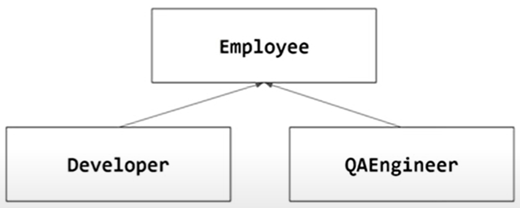
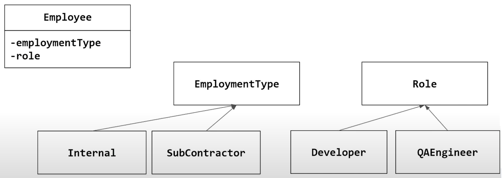

.. contents:: Table of Contents

Object-Oriented Programming in C++
===================================

**class** the code that describes an entity

**object** the actual instance of a class

A class should only have a single responsibility.

Access Modifiers
-----------------

**public**

accessed by anyone

**protected**

accessed by the class itself and derived classes

**private**

access by the class itself only

.. note::
	You can access privates of other objects of the same class - the privilage is on the class not on the object
    
::

	default privilage in class is private
	default privilage in struct is public

::

	default inheritance mode in class is private
	default inheritance mode in struct is public

Data Members
-------------

each object has its own copy of the data members

usually (almost always) should be private

there is no default initialization for primitive types if not initialized

Member Functions (methods)
-----------------------------

member functions might be public, protected or private

are called using an object

can access data members of the calling object

is not part of the object size

Object Size
------------

include the size of its members

does not include the size of its functions

in case of inheritance includes the size of its parents

may include additional parts, e.g. pointer to vtable

may include padding

this
------

this is a pointer to the calling object

it is implicitly introduced by the compiler

Constructor
-------------

**Rules**

no constructor at all - there is empty constructor by default

no empty constructor - must pass parameter to

can overload constructors

C++ 11 can call another constructor ("construtor delegation")

can use default parameters

constructor init list

default copy constructor does **member wise copy**

default member assignment operator does **member wise assignment**

**can we implement assignment operator as global, like this?**

.. code:: cpp

	A& operator=(A & a1, const A & a2);
    
**NO**, because you have to override the default, and default is considered as member assignment operator

**can we take parameter by value in assignment operator, like this?**

.. code:: cpp

	A& A::operator=(A a);
    
**YES**, it is used in some idioms like copy and swap

use **explicit** keyword with constructor if you do not want implicit cast

Destructor
----------

called automatically when object dies

Takes no argument, thus there is only one per class

Guaranteed to be called immediately when object dies

Usually used for resource deallocattions

When oject dies
^^^^^^^^^^^^^^^

stack object: at the end of block

heap object:	when delete is called for the object

global or static object:	at the end of the process

temporary object:	by the end of the statement

Rule of Zero, Three and Five
----------------------------

Rule of Zero
^^^^^^^^^^^^^

Best Practice: your class does not need any resource management

no need for destructor, copy operations and move operations

defaults are sufficient 

to achieve this use properly managed data members std::string, smart pointers, std containers

Rule of Three
^^^^^^^^^^^^^

If a destructor is needed firstly block the copy operations

If you need later and is necessary implement them

Rule of Five
^^^^^^^^^^^^^

If you implement or block any of the five, you lose the defaults for the move operations

Inheritance
------------

**Why?**

Code reuse 

Polymorphism

OO Low-Level Design Principles
-------------------------------

A class shall represent a single thing

Break a complicated entity into several smaller classes

Use composition and inheritance properly

Keep Abstraction - implement your code for a "generic" interface

try to keep your classes under the rule of zero

Inheritance
-----------

When using a inheritance like this

Issue with this type of inheritance is that if we want QAEnginner to make DevEngineer there is no way to do that without destructing the QAEnginner object and then creating a DevEngineer object

Instead make specific classes, like this

This will use state design pattern and will be better 

We can change the role of an employee to DevEngineer without destructing the object

Issue with inheritance
------------------------

changing type at run-time

inflation in derived classes (need to think of the way to reduce number of classes)

**Solution** State or Strategy patterns

Forces the user to be in the details of our internal design (which exact type to create)

**Solution** Factory method or Abstract factory method pattern

Inheritance Design Principles
------------------------------

**Scott Meyers**

- Make non-leaf classes abstract

**Herb Sutter**

- Don't derived from concrete classes
- Make virtual functions private

**Amir Kirsh**

- User should work with a universal type - same type represents all
- Prefer to have **stateless abstract classes** ("pure interfaces")
- If a base class does manage data, keep it very small and specific

Substitutes for Inheritance
----------------------------

**Avoiding Inheritance** - use template, composition, lambdas or just simple "duck type" with generic algorithms

Inheritance of smaller things use state/strategy for properties, behavior and policy

Hiding your inheritance with a facade/proxy of a one clear type, use should preferably work with one universal type

References
-----------

`Back to Basics: Object-Oriented Programming in C++ - Amir Kirsh - CppCon 2022 <https://www.youtube.com/watch?v=_go74QpFPAw>`_
	

